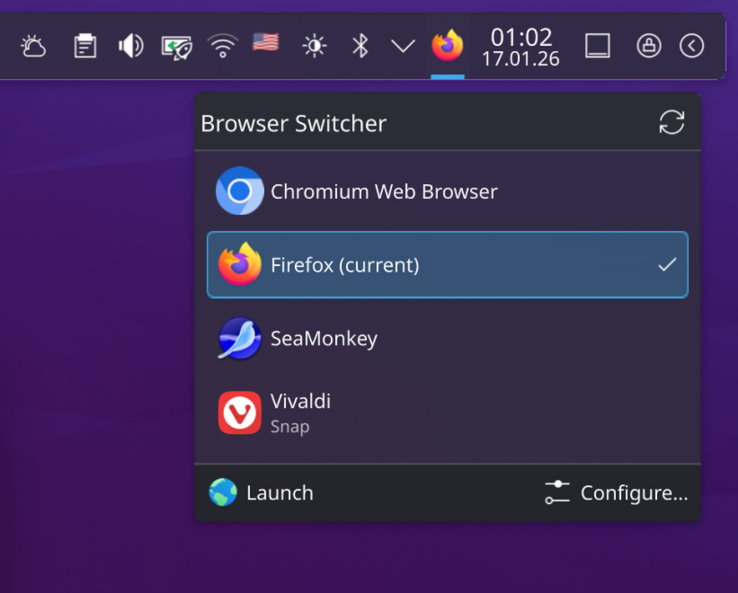
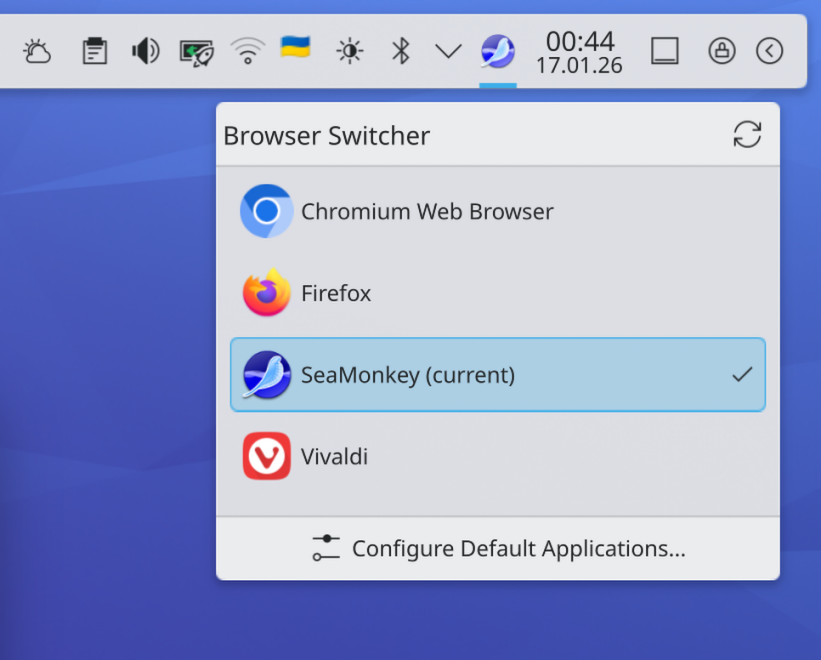
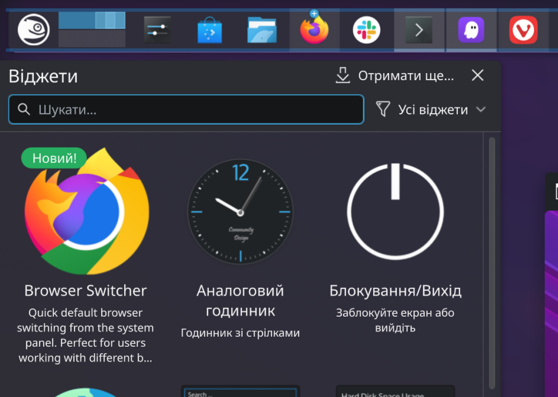

# Browser Switcher for KDE Plasma 6

<p align="center">
  
</p>

**🚀 Quick default browser switching from the KDE Plasma panel**

[](https://github.com/totoshko88/browser-switcher-plasmoid/releases)
[](LICENSE)

[](https://www.pling.com/p/2342330/)

---

## Screenshots

| Dark Theme | Light Theme |
|:----------:|:-----------:|
|  |  |

*Seamlessly integrates with your Plasma desktop*



*Easy installation via Plasma widget browser*

---

## Features

| Feature | Description |
|---------|-------------|
| 🚀 **Simple & Fast** | One-click browser switching |
| 🎯 **Zero Configuration** | Works out of the box |
| 🪶 **Lightweight** | No external dependencies |
| 🔄 **Auto-Detection** | Finds all installed browsers automatically |
| 🎨 **Native Integration** | Matches KDE Plasma design |
| ⚡ **Non-Blocking** | Async operations for smooth performance |
| ⌨️ **Keyboard Navigation** | Full arrow key and Enter support |
| 💾 **Smart Caching** | Faster startup with browser list caching |
| 🔔 **System Tray Ready** | Can be placed in notification area |
| 📦 **Package Labels** | Shows Flatpak/Snap indicators |
| ⚙️ **Configurable** | Customizable refresh interval and behavior |

## Use Case

Perfect for users who work with different browser profiles for different tasks — for example, separate work and personal SSO authentication.

## Requirements

- KDE Plasma 6.0 or later
- Wayland or X11
- `xdg-settings` (usually pre-installed via `xdg-utils`)

---

## Installation

### From KDE Store (Recommended)

**https://www.pling.com/p/2342330/**

Or via Plasma UI:
- Right-click desktop → "Add Widgets..." → "Get New Widgets..." → "Download New Plasma Widgets..."
- Search for "Browser Switcher"

### From GitHub Releases

1. Download the latest `.plasmoid` file from [Releases](https://github.com/totoshko88/browser-switcher-plasmoid/releases)
2. Install via terminal:
   ```bash
   kpackagetool6 -t Plasma/Applet -i browser-switcher-*.plasmoid
   ```
   
   Or via Plasma UI:
   - Right-click desktop → "Add Widgets..." → "Get New Widgets..." → "Install from Local File..."

### From Source

```bash
# Clone the repository
git clone https://github.com/totoshko88/browser-switcher-plasmoid.git
cd browser-switcher-plasmoid

# Install
./install.sh

# Or manually
kpackagetool6 -t Plasma/Applet -i package/
```

### Update Existing Installation

```bash
kpackagetool6 -t Plasma/Applet -u package/
```

### Uninstall

```bash
kpackagetool6 -t Plasma/Applet -r org.kde.plasma.browserswitcher
```

---

## Usage

### Keyboard Shortcuts

| Key | Action |
|-----|--------|
| ↑/↓ | Navigate browser list |
| Enter | Select highlighted browser |
| Esc | Close popup |

### Context Menu

Right-click the panel icon for quick access to:
- **Launch Browser** — Open current default browser
- **Configure Default Applications** — Opens system settings
- **Refresh** — Rescan for browsers

### Configuration

Right-click the widget → "Configure..." to access settings:

| Setting | Description |
|---------|-------------|
| **Refresh interval** | How often to check for external browser changes (1-60 min) |
| **Show browser type** | Display Flatpak/Snap labels next to browser names |
| **Auto-close popup** | Automatically close popup after switching browsers |

---

## How It Works

### Browser Detection

Scans XDG directories for `.desktop` files with `WebBrowser` category:

```
/usr/share/applications/
/usr/local/share/applications/
~/.local/share/applications/
/var/lib/snapd/desktop/applications/          # Snap
/var/lib/flatpak/exports/share/applications/  # Flatpak (system)
~/.local/share/flatpak/exports/share/applications/  # Flatpak (user)
```

### Default Browser Management

Uses `xdg-settings` for cross-desktop compatibility:

```bash
xdg-settings get default-web-browser           # Get current
xdg-settings set default-web-browser app.desktop  # Set new
```

---

## Development

### Testing

```bash
# Test in a window
plasmawindowed org.kde.plasma.browserswitcher

# Or use plasmoidviewer
plasmoidviewer -a org.kde.plasma.browserswitcher
```

### Project Structure

```
browser-switcher-plasmoid/
├── .github/workflows/        # CI/CD
│   ├── release.yml           # Build & release on tags
│   └── validate.yml          # Validate on push/PR
├── package/
│   ├── metadata.json         # Plasmoid metadata (Plasma 6)
│   └── contents/
│       ├── icon.png          # Widget icon
│       ├── config/           # Configuration
│       ├── locale/           # Translations
│       └── ui/               # QML components
├── screenshots/              # README images
├── scripts/                  # Helper scripts
├── install.sh
├── uninstall.sh
└── README.md
```

---

## Changelog

See [CHANGELOG.md](CHANGELOG.md) for full version history.

---

## Contributing

Contributions welcome! Please ensure:
- Code follows KDE QML style guidelines
- Test on both Wayland and X11
- Test with Plasma 6.0+

---


## Support

If you find this extension useful, consider supporting development:

[](https://ko-fi.com/totoshko88)
[](https://www.paypal.com/qrcodes/p2pqrc/JJLUXRZSQ5V3A)
[](https://send.monobank.ua/jar/2UgaGcQ3JC)
---

## License

GPL-3.0 — Made with ❤️ in Ukraine 🇺🇦

---

## Credits

Based on the [GNOME Browser Switcher](https://github.com/totoshko88/browser-switcher) extension.
